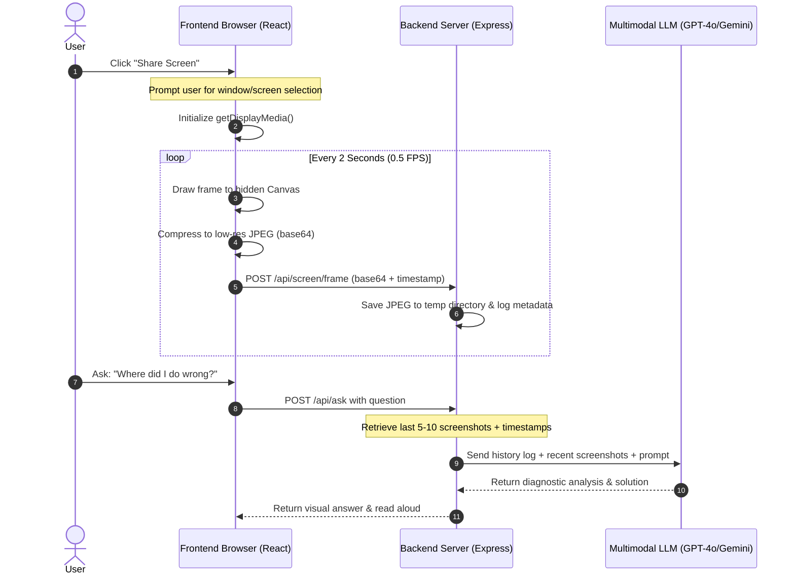
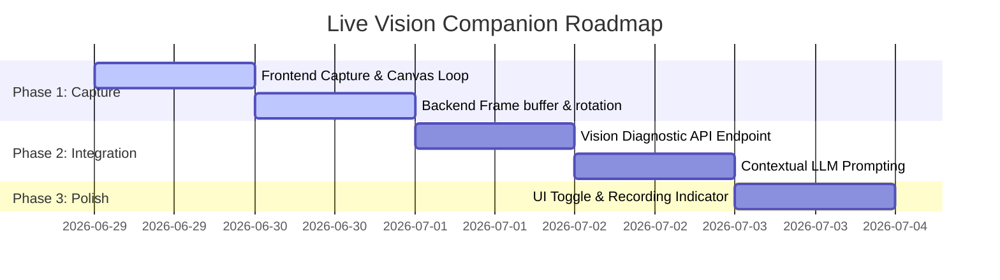

# Feasibility Study: Real-Time Screen Sharing & Vision-Assisted Companion in Qwen OS

This report analyzes the feasibility of adding **real-time screen sharing and active visual monitoring** to Qwen OS. The goal is to allow the desktop companion to "see" the user's screen in real-time, log the activity history, and answer contextual questions like *"Where did I do wrong?"* or *"What should I do next?"* based on the visual timeline.

---

## 📊 Feasibility Verdict: **HIGHLY FEASIBLE (8/10)**

Integrating this feature is highly practical because modern browsers natively support screen capture APIs, and multimodal models (like GPT-4o or Gemini 1.5 Pro) are extremely capable of describing UI frames and troubleshooting user workflows.

### **Core Trade-offs at a Glance:**
| Metric | Real-Time Multimodal Stream (Active Vision) | On-Demand Visual Diagnostic (Passive Capture) |
| :--- | :--- | :--- |
| **API Costs** | 🔴 Very High (needs continuous API calls) | 🟢 Very Low (only calls LLM on question) |
| **Latency** | 🟡 1-3 seconds per frame | 🟢 Near-instantaneous response |
| **Context Size** | 🔴 Fast context bloating | 🟢 Highly optimized context |
| **Complexity** | 🟡 High (needs WebSocket streaming) | 🟢 Medium (uses HTTP POST + local frames) |

---

## 🗺️ Proposed Architecture

The system will operate as a **continuous local frame buffer**. The frontend captures and compresses screen frames, uploads them to the backend, and only calls the Vision LLM when the user asks a question, saving massive API costs.



---

## 🛠️ Core Implementation Components

### 1. Frontend: Capture & Compression (React)
Using the browser's native standard `getDisplayMedia` API combined with a hidden canvas, we can capture the screen stream at `0.5 FPS` (1 frame every 2 seconds) and compress it to `100KB` JPEG frames to preserve network bandwidth and backend disk space.

#### **Draft Frontend Code:**
```typescript
let screenStream: MediaStream | null = null;
let captureInterval: any = null;

async function startScreenSharing() {
  try {
    screenStream = await navigator.mediaDevices.getDisplayMedia({
      video: { frameRate: 1 } // Low frame rate to save CPU
    });
    
    const video = document.createElement('video');
    video.srcObject = screenStream;
    video.play();

    const canvas = document.createElement('canvas');
    const ctx = canvas.getContext('2d');

    captureInterval = setInterval(() => {
      if (video.readyState === video.HAVE_ENOUGH_DATA && ctx) {
        canvas.width = 1280;  // Standard downscaled width
        canvas.height = 720; // Standard downscaled height
        ctx.drawImage(video, 0, 0, canvas.width, canvas.height);
        
        // Compress as low-quality JPEG
        const base64Frame = canvas.toDataURL('image/jpeg', 0.5); 
        
        // Send base64 frame to backend
        fetch('http://localhost:3000/api/screen/frame', {
          method: 'POST',
          headers: { 'Content-Type': 'application/json' },
          body: JSON.stringify({
            image: base64Frame,
            timestamp: Date.now()
          })
        });
      }
    }, 2000); // Capture frame every 2 seconds
  } catch (err) {
    console.error("Screen share access denied:", err);
  }
}
```

### 2. Backend: Local Frame Buffer (Express)
*   **Storage:** Keep files in `backend/temp/screen_history/`.
*   **Rotation:** A simple cleanup mechanism keeps only the last **150 frames** (equivalent to 5 minutes of history) and purges older files to ensure the user's hard drive is not filled up.
*   **Endpoint `/api/screen/frame`:**
    ```javascript
    app.post('/api/screen/frame', (req, res) => {
      const { image, timestamp } = req.body;
      const base64Data = image.replace(/^data:image\/jpeg;base64,/, "");
      
      const filename = `frame_${timestamp}.jpg`;
      fs.writeFileSync(path.join(__dirname, 'temp/screen_history', filename), base64Data, 'base64');
      
      // Maintain log of events
      fs.appendFileSync(
        path.join(__dirname, 'temp/screen_history', 'metadata.jsonl'),
        JSON.stringify({ timestamp, filename }) + '\n'
      );
      
      // Trigger rotation cleanup (keep last 150 frames)
      rotateLogs();
      res.sendStatus(200);
    });
    ```

### 3. Backend: Vision Diagnostic Agent
When the user asks *"Where did I do wrong?"*:
1.  The orchestrator retrieves the last 5-10 screenshots from the folder.
2.  It sends them as image parts along with the user's question directly to the multimodal model.
3.  **LLM Prompt:**
    ```text
    You are the Qwen OS Vision Diagnostic Agent. The user is asking "where did I do wrong?". 
    Below is a sequence of screenshots of their screen, taken at 2-second intervals, ending with the current screen.
    Analyze the sequence to find the user's error (e.g. syntax errors, wrong command executed, failed settings, layout misalignments) and explain step-by-step how to correct it.
    ```

---

## ⚠️ Technical Challenges & Mitigations

### 1. High API Costs and Token Limits
*   **Problem:** Sending screenshots continuously to GPT-4o/Gemini would consume millions of tokens and cost hundreds of dollars per hour.
*   **Mitigation:** The frontend only uploads the screenshots to the *local backend server*. The backend stores them on disk without calling the LLM. We only send the images to the LLM *on-demand* (i.e. when the user explicitly triggers a question).

### 2. Security & User Privacy
*   **Problem:** Screen sharing can capture sensitive data (passwords, private chats, bank info).
*   **Mitigation:**
    *   Store all frames strictly in the local `backend/temp/` folder. They are never sent to external servers unless the user asks an AI question.
    *   Provide a clear visual indicator (e.g., a flashing red record dot in the PiP bar) showing when screen recording is active, and a one-click stop button.
    *   Auto-delete all frames on application exit.

### 3. CPU/Memory Overhead
*   **Problem:** Drawing to canvas and encoding base64 every 2 seconds could cause lag on lower-end machines.
*   **Mitigation:** Downscale frames to `1280x720` and use low JPEG compression quality (`0.4` or `0.5`). This is more than readable for text/code diagnostics but keeps CPU and memory footprints minimal.

---

## 📈 Next Steps & Timeline Estimate

If approved, this feature can be built in three logical phases:



*   **Total Estimate:** **3 Days** (approx. 12-16 hours of pairs coding).
