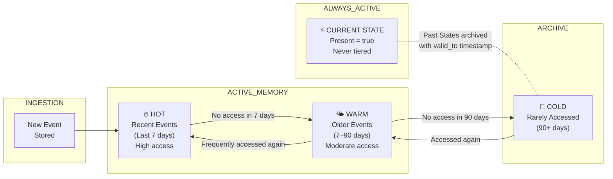
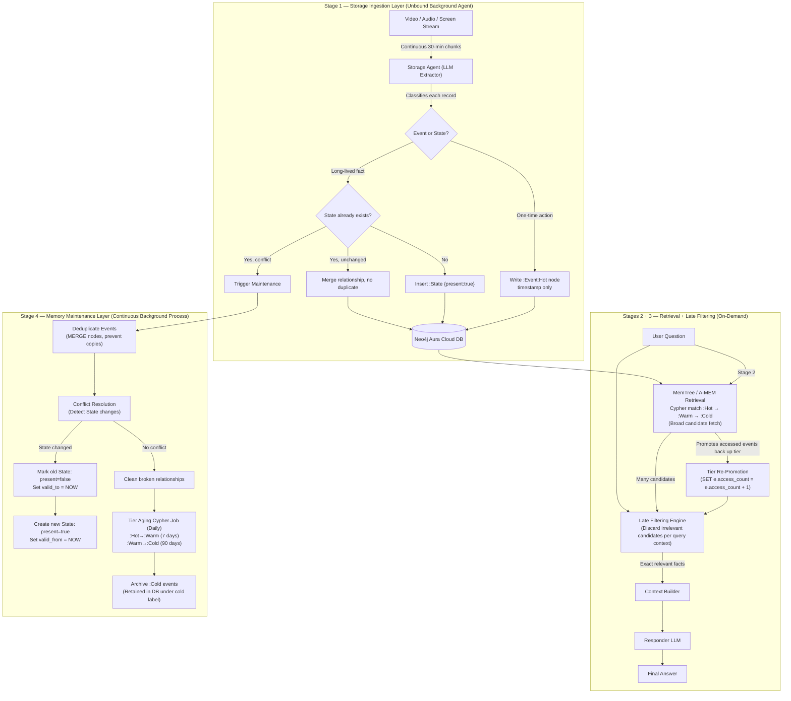

# Event-Native Memory System for Video-Based Agentic Applications
### Version 5 — Final: Neo4j Aura Cloud Graph Database & Hot/Warm/Cold Tiering

---

## Core Design Principle

**Never lose information during storage. Only filter during retrieval.**

The system operates across four stages. Each stage has one clear job and does not overlap with the others:

| Stage | Layer | Job |
|---|---|---|
| **Extraction & Storage** | Ingestion Agent | Capture raw events from video and write to the Neo4j graph |
| **Retrieval** | MemTree / A-MEM | Fetch broad candidate memories from the Neo4j graph |
| **Late Filtering** | Filter Engine | Keep only what the current query needs |
| **Maintenance** | Memory Manager | Keep the graph clean, tiered, consistent, and up to date |

---

## 1. The Events vs. States Model

Not every memory node carries a Present/Past tag. We separate graph records into two fundamentally different node types in Neo4j.

### Events (Immutable Records)

Things that happened once at a specific point in time. They never change. They have **no Present/Past lifecycle — only a timestamp.**

**Examples:**
- Opened Docker at 10:15 AM
- Manager asked "Did you watch the soccer match?" at 09:15
- Clicked the Run button
- Watched a YouTube video at 14:00

**Ask:** *"When did I open Docker?"*
**→** System executes Cypher query over `:Event` nodes: *"You opened Docker at 10:15 AM. Five minutes later you started a container."*
No Present tag involved. The event happened once and is always true.

**Event node Cypher schema:**
```cypher
(:Event {
  id           : UUID,
  timestamp    : ISO-8601,
  actor        : "User" | "System" | "Manager",
  action       : "OPENED" | "CLICKED" | "ASKED" | "WATCHED",
  object       : "Docker" | "YouTube" | "Project Alpha",
  raw_content  : Full transcription / OCR / screenshot text,
  source       : "video" | "audio" | "screen" | "tool",
  topic_tags   : ["docker", "containers", "devops"],
  video_ref    : '{"video_id": "...", "timestamp_seconds": 120}',
  tier         : "hot" | "warm" | "cold",       // Memory aging tier
  access_count : Integer,                       // Increments on each retrieval
  last_accessed: ISO-8601
})
```

---

### States (Mutable Long-Lived Facts)

Things that describe the user's current situation and can change over time. **Only States carry Present/Past lifecycle tags.**

**Examples:** current company, current project, current location, preferred editor.

**Ask:** *"Where do I currently work?"*
**→** System matches `:State {present: true}` nodes in Neo4j.

**State node Cypher schema:**
```cypher
(:State {
  id          : UUID,
  attribute   : "WORKS_AT" | "WORKS_ON" | "USES_EDITOR",
  value       : "Company A" | "Project Alpha",
  present     : Boolean,
  valid_from  : ISO-8601,
  valid_to    : ISO-8601 | null
})-[:HAS_STATE]->(:Entity {id: "User"})
```

**Decision Rule:**
> Add a `present` property **only** to nodes that describe the user's current condition and can change over time. Never add `present` tags to one-time events or timestamped actions.

---

## 2. Hot / Warm / Cold Memory Tiering (Timely Forgetting)

This is the **memory aging policy** — the mechanism that answers "timely forgetting" without ever deleting historical information.

> **The agent never deletes memories immediately. Instead, it automatically transitions them through Hot → Warm → Cold storage based on recency and access frequency. State memories are separately versioned using Present/Past tags.**

### Tier Definitions

| Tier | Description | Retrieval Priority | Neo4j Storage Representation |
|---|---|---|---|
| **Hot** | Recent events (last 7 days) or actively accessed | Checked first, highest index priority | `:Event:Hot` label indexed in Neo4j Aura |
| **Warm** | Older events (7–90 days) with moderate access | Checked second | `:Event:Warm` label in Neo4j Aura |
| **Cold** | Rarely accessed or >90 days old | Checked only if needed | `:Event:Cold` label (archival partition) |
| **Current State** | `present = true` States | Always active, always checked | `:State {present: true}` nodes |



### Tiering Rules

```
On INSERT:
  → Event node created with label :Event:Hot
  → access_count = 0, last_accessed = NOW

On RETRIEVAL (any event accessed via Cypher match):
  → access_count += 1
  → last_accessed = NOW
  → If label is :Cold or :Warm → remove label and set label :Warm or :Hot

Maintenance Aging (runs daily background job):
  → MATCH (e:Event:Hot) WHERE e.last_accessed < NOW - 7 days REMOVE e:Hot SET e:Warm
  → MATCH (e:Event:Warm) WHERE e.last_accessed < NOW - 90 days REMOVE e:Warm SET e:Cold
  → State nodes (:State {present: true}) → never tiered, always active
```

---

## 3. Full Memory Pipeline Architecture



---

## 4. Retrieval: MemTree / A-MEM in Neo4j

Retrieval casts a **wide net** using fast Cypher graph traversals, starting from the hottest memories and expanding outward only if needed.

```
User Query: "Did my manager ask about soccer?"

↓ MemTree traversal over Neo4j Aura — :Hot tier first
  MATCH (e:Event:Hot)-[:INVOLVES]->(actor:Entity {name: "Manager"})
  WHERE "sports" IN e.topic_tags
  RETURN e

↓ Tier Re-Promotion
  SET e.access_count = e.access_count + 1, e.last_accessed = datetime()

↓ Late Filtering
  - Query context: soccer
  - Keeps:    Event C ("Manager asked about soccer match at 09:15")
  - Discards: Events A, B, D, E (project discussion)

↓ LLM receives: Event C only
→ "Yes, your manager asked about the soccer match at 09:15."
```

---

## 5. Maintenance: Memory Manager

The maintenance process runs continuously against the Neo4j Aura instance. It **does not create or retrieve memories**. It only keeps the graph accurate and efficiently tiered.

| Task | Description |
|---|---|
| **State Conflict Detection** | New State contradicts existing `:State {present: true}` node |
| **State Transition** | Sets old node `present=false`, `valid_to=NOW`, creates new `present=true` node |
| **Tier Aging** | Cypher update shifting labels `:Hot` → `:Warm` → `:Cold` based on timestamps |
| **Tier Promotion** | Promotes `:Cold` / `:Warm` back to `:Hot` when accessed |
| **Deduplication** | Uses Neo4j `MERGE` clauses to link repeated events to canonical nodes |
| **Link Cleanup** | Removes dangling relationships |

**State Transition Example:**

```cypher
// BEFORE:
(:State {value: "Company A", present: true, valid_from: "2025-01-01", valid_to: null})

// User says: "I now work at Company B"
// Maintenance executes Cypher transaction:
MATCH (old:State {attribute: "WORKS_AT", present: true})
SET old.present = false, old.valid_to = datetime()
CREATE (new:State {attribute: "WORKS_AT", value: "Company B", present: true, valid_from: datetime()})

// AFTER:
(:State {value: "Company A", present: false, valid_from: "2025-01-01", valid_to: "2026-06-29T22:15:00Z"})
(:State {value: "Company B", present: true,  valid_from: "2026-06-29T22:15:00Z", valid_to: null})
```

---

## 6. Neo4j Aura Database Credentials & Configuration

The connection configuration has been verified and added to `backend/.env`:

```env
NEO4J_URI=neo4j+s://55114263.databases.neo4j.io
NEO4J_USERNAME=55114263
NEO4J_PASSWORD=imkKPqnCd0NJHfdOfFAUs4h2AEvJ7iyj35K-2vwtOag
NEO4J_DATABASE=55114263
AURA_INSTANCEID=55114263
AURA_INSTANCENAME="Free instance"
```

---

## 7. Proposed Code Changes

### Backend

#### [NEW] [neo4jService.js](file:///c:/Users/venka/Test-Qwen/backend/services/neo4jService.js)
- Initializes official `neo4j-driver` using environment credentials
- Connection pool management and session handling for Aura cloud
- Cypher query builders for inserting Events (`:Event:Hot`) and States (`:State`)

#### [NEW] [eventMemoryService.js](file:///c:/Users/venka/Test-Qwen/backend/services/eventMemoryService.js)
- Uses `neo4jService` to execute graph operations
- Storage Agent: video chunk ingestion → LLM schema extractor → Event vs State classifier
- MemTree / A-MEM graph traversal starting `:Hot` → `:Warm` → `:Cold`
- Tier re-promotion Cypher queries on retrieval hits
- Late filtering handler
- Maintenance runner: conflict detection, state transitions, daily tier aging queries

#### [MODIFY] [server.js](file:///c:/Users/venka/Test-Qwen/backend/server.js)
- `POST /api/memory/start` — Start background storage agent
- `POST /api/memory/stop` — Stop background storage agent
- `GET  /api/memory/status` — Neo4j Aura connection status, node counts by tier, active state facts
- `POST /api/memory/query` — Full pipeline: Cypher Retrieve → Filter → Respond

### Frontend

#### [NEW] [MemoryBookManager.tsx](file:///c:/Users/venka/Test-Qwen/frontend/src/components/MemoryBookManager.tsx)
- **Agent Control Panel**: ON/OFF toggle for background recording with live ingestion log
- **Book Pages View (Left)**: Day-by-day timeline of raw `:Event` nodes fetched from Neo4j with tier badges (🔥 HOT / 🌤 WARM / 🧊 COLD)
- **State Inspector**: Shows `present=true` active graph nodes and full historical timeline
- **Tier Dashboard**: Live node counts from Neo4j across `:Hot`, `:Warm`, `:Cold` labels
- **Retrieval Sandbox**: Query input → visualizes Neo4j candidate nodes → late filter output → final LLM answer

#### [MODIFY] [App.tsx](file:///c:/Users/venka/Test-Qwen/frontend/src/App.tsx)
- Adds **Memory Book** icon to the macOS Dock
- Opens MemoryBookManager window

---

## 8. Verification Plan

### Automated Test Script

**[NEW] [test_neo4j_pipeline.js](file:///c:/Users/venka/Test-Qwen/backend/test_neo4j_pipeline.js)**

1. Connect to Neo4j Aura using credentials in `.env` and verify connectivity
2. Ingest mock session nodes into Neo4j:
   - Project discussion (`:Event:Hot`)
   - Soccer interruption (`:Event:Hot`)
   - Job title change (`:State` transition query)
3. Execute Cypher aging queries → verify node labels transition from `:Hot` to `:Warm` to `:Cold`
4. Access a `:Cold` node → verify Cypher promotes label back to `:Warm` / `:Hot`
5. Verify Cypher queries:
   - `"When did I open Docker?"` → returns timestamped `:Event`
   - `"Where do I currently work?"` → returns `:State {present: true}`

### Manual Verification
1. Open Neo4j Aura Console (`https://console.neo4j.io`) to visualize live graph nodes
2. Open **Memory Book** in the desktop simulator and click **Start Video Capture Recording**
3. Verify new nodes appear dynamically in Neo4j with `:Hot` labels
4. Run queries in the **Retrieval Sandbox** and confirm real-time Cypher traversal speed
